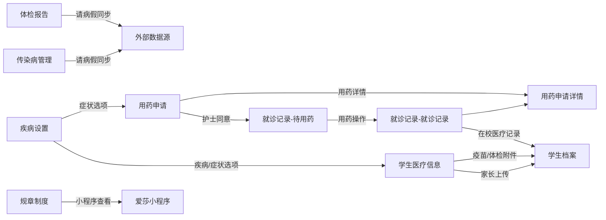

# 校医管理后台需求

> 来源：2026国际教育在线社区 V2.19（校医管理）需求规格说明书 v1.0  
> 整理范围：**管理后台**（不含爱莎小程序端，小程序需求见原文档第三节）  
> 对应代码目录：`src/views/isacommunity/schoolDoctor/`

---

## 文档说明

| 项目   | 内容           |
| ---- | ------------ |
| 版本   | 1.0          |
| 版权   | 广州优亚信息技术有限公司 |
| 一级菜单 | 校医管理         |

---

## 一、通用部分

### 1.1 系统使用账号

| 渠道     | 使用者  |
| ------ | ---- |
| 学校运营后台 | 校医   |
| 爱莎小程序  | 学生家长 |

### 1.2 权限说明（管理后台）

超管与校医对管理后台各模块均拥有 **查看 / 编辑 / 新增 / 删除** 权限。

| 模块     | 查看  | 编辑  | 新增  | 删除  | 导入  | 导出  |
| ------ | --- | --- | --- | --- | --- | --- |
| 学生档案   | √   | √   | √   | √   | —   | —   |
| 学生医疗信息 | √   | √   | √   | √   | √   | √   |
| 规章制度   | √   | √   | √   | √   | —   | —   |
| 就诊记录   | √   | √   | √   | √   | —   | —   |
| 用药申请   | √   | √   | √   | √   | —   | —   |
| 体检报告   | √   | √   | √   | √   | √   | √   |
| 传染病管理  | √   | √   | √   | √   | √   | √   |
| 疾病设置   | √   | √   | √   | √   | —   | —   |

**补充说明：**

- 所有页面需做 **数据隔离**，家长（小程序）仅能查看绑定学生数据。
- 学生医疗信息、用药申请的 **导入 / 导出** 需做权限控制。
- 学生档案中 **家长联系方式** 需单独权限，有权限人员才可查看。
- 就诊记录中操作记录的 **编辑按钮** 需做权限控制。

### 1.3 业务场景（后台）

| 场景     | 说明                      |
| ------ | ----------------------- |
| 医疗制度   | 校医通过后台增删查改规章制度          |
| 疾病设置   | 校医通过后台增删查改疾病/症状字典       |
| 学生档案   | 校医通过后台查看学生医疗档案          |
| 医疗基础信息 | 校医通过后台增删查改、导入导出学生医疗基础信息 |
| 用药申请   | 校医通过后台增删查改、审批用药申请       |
| 就诊记录   | 校医通过后台增删查改就诊记录          |
| 传染病    | 校医通过后台增删查改、导入导出传染病数据    |
| 体检报告   | 校医通过后台增删查改、导入导出体检报告     |

### 1.4 公共交互规范

以下规范适用于各模块列表页（除非模块另有说明）：

| 规范项   | 说明                            |
| ----- | ----------------------------- |
| 页面结构  | 查询区 + 操作区 + 展示区               |
| 分页    | 单页 10 条，按时间倒序                 |
| 页码    | 当前页码、上一页、下一页、点击页码跳转           |
| 查询    | 有筛选条件则按条件查；无条件点击查询显示全部        |
| 删除    | 勾选后弹出「将永久删除勾选的内容，确认删除？」，确认后删除 |
| 创建者   | 默认当前登录账号                      |
| 保存/取消 | 保存提交数据，取消不保存                  |

### 1.5 学校选项

**学生相关模块**（学生档案、学生医疗信息、用药申请、就诊记录、传染病管理、体检报告）使用 **School 级** 学校：

- ISA Wenhua Liwan School
- ISA Liwan International School
- ISA Wuhan International School
- ISA Wenhua Wuhan School
- ISA Wenhua Wuhan high School
- ISA Tianhe International school
- ISA Wenhua Guangzhou Foreign Language IB Programme
- ISA Science City International School

**规章制度模块** 使用 **Campus 级** 学校：

- ISA Liwan Campus
- ISA Wuhan Campus
- ISA Tianhe International school
- ISA Wenhua Guangzhou Foreign Language IB Programme
- ISA Science City International School

---

## 二、模块需求

### 2.1 学生档案

> 菜单：校医管理 → **学生医疗档案**  
> 代码目录：`studentRecord/`

#### 2.1.1 列表页

**查询条件**

| 字段       | 类型   | 说明             |
| -------- | ---- | -------------- |
| 学校       | 下拉单选 | School 级学校列表   |
| 学生姓名/学号  | 输入   | 模糊匹配           |
| 是否有过敏原   | 下拉   | 是 / 否          |
| 是否定期服用药物 | 下拉   | 是 / 否          |
| 是否有相关疾病  | 下拉   | 是 / 否          |
| 档案状态     | 下拉   | 已建档 / 注销 / 待完善 |

**操作区：** 删除

**列表字段**

选择框、序号、学校、学号、姓名、年级、班级、是否住宿、是否过敏原、是否定期服用药物、是否有疾病、档案状态、创建者、创建时间、更新时间、操作（查看、编辑）

**字段展示规则**

| 字段       | 规则                                                    |
| -------- | ----------------------------------------------------- |
| 档案状态     | **已建档**：健康与病史、疫苗及体检信息均有记录；**待完善**：部分信息缺失；**注销**：学生已离校 |
| 是否过敏原    | 过敏类型任一项有值 → 显示「有过敏源」                                  |
| 是否定期服用药物 | 长期使用药物有值 → 显示「有长期使用药物」                                |
| 是否有疾病    | 疾病项有值 → 显示「有」                                         |
| 建档来源     | 学生入校自动建档，信息来源于数据平台                                    |

#### 2.1.2 查看页（4 个 Tab）

**Tab 1：学生信息**

学校、学号、姓名、年级、班级、住宿、房间、校巴、家长联系方式（关系、手机号码、邮箱地址）

> 家长联系方式需权限控制。

**Tab 2：健康与病史信息**

- **基础健康信息**：身高、体重、视力（左/右）、听力（左耳/右耳）
- **个人病史**：来源于家长上传的医疗信息
  - 过敏信息：食物过敏、药物过敏、接触过敏、其他过敏
  - 疾病：疾病名称、目前病情、是否需要在学校定期服用药物、服用药物及方式、发作时间及具体情况、采取措施、医疗诊断和处理
- **护士备注**

**Tab 3：疫苗及体检信息**

显示最新疫苗预防针证件和体检报告信息。

**Tab 4：在校医疗记录**

| 字段                  | 说明  |
| ------------------- | --- |
| 选择框、ID、日期、到访时间、病情主述 | —   |
| 体征/伤口检查结果、初步判断      | —   |
| 主要处理措施/用药记录、特殊备注    | —   |
| 处理护士、离开时间、离开后去向     | —   |
| 是否联系家长、创建时间         | —   |

> 数据来源：就诊记录。

#### 2.1.3 编辑页

- 字段与查看页一致
- **可编辑**：基础健康信息、护士备注
- **不可编辑**：其余字段通过其他数据源获取

---

### 2.2 学生医疗信息

> 菜单：校医管理 → **学生医疗信息**  
> 代码目录：`medicalInfo/`

#### 2.2.1 列表页

**查询条件**

| 字段       | 类型   | 说明       |
| -------- | ---- | -------- |
| 学校       | 下拉单选 | School 级 |
| 学生姓名/学号  | 输入   | 模糊匹配     |
| 是否有过敏原   | 下拉单选 | 是 / 否    |
| 是否定期服用药物 | 下拉单选 | 是 / 否    |
| 是否有相关疾病  | 下拉   | 是 / 否    |

**操作区：** 新增、删除、导入、导出（导入/导出需权限）

**列表字段**

选择框、序号、学校、学号、姓名、年级、班级、是否住宿、是否有过敏原、是否定期服用药物、是否有疾病、操作者、创建时间、更新时间、操作（查看、编辑）

| 字段   | 规则                           |
| ---- | ---------------------------- |
| 操作者  | 小程序来源 → 显示「家长」；后台新增 → 显示操作账号 |
| 更新时间 | 最新一次更新时间，格式：年月日时分            |

#### 2.2.2 新增页

**学生基本信息**

学校（单选）、学号（输入后反显姓名/年级/班级）、姓名、年级、班级

**基础健康信息**

身高、体重、左视力、右视力、左耳、右耳（均支持输入）

**个人病史**

- **过敏信息**（输入框）：食物过敏、药物过敏、接触过敏、其他过敏
- **疾病信息**：
  - 疾病名称：下拉选择疾病设置中的项，选「其他」可手动输入
  - 目前病情：已经痊愈 / 偶尔发作 / 经常发作（单选，**必填**）
  - 是否需要在学校定期服用药物：是 / 否（**必填**）
  - 服用药物及方式：选「是」时**必填**，否则非必填
  - 发作时间及具体情况、采取措施、医疗诊断和处理：输入框，非必填

**附件**

| 附件类型   | 说明          |
| ------ | ----------- |
| 疫苗     | 上传附件        |
| 入学体检   | 上传附件        |
| 医疗特殊证明 | 输入说明 + 上传附件 |
| 家长签名   | 上传附件        |

#### 2.2.3 详情 / 编辑页

- 字段与新增页一致
- 增加 **ID** 字段（系统自动生成）

---

### 2.3 规章制度

> 菜单：校医管理 → **规章制度**  
> 代码目录：`regulation/`

#### 2.3.1 列表页

**查询条件**

| 字段  | 类型   | 说明                 |
| --- | ---- | ------------------ |
| 学校  | 下拉单选 | Campus 级           |
| 状态  | 下拉单选 | 启用 / 禁用            |
| 类型  | 下拉单选 | 规章制度 / 知情同意 / 授权同意 |
| 文件名 | 输入   | 模糊匹配               |

**操作区：** 新增、删除

**列表字段**

选择框、序号、学校、文件名、类型、状态、创建者、创建时间、更新时间、操作（查看、编辑）

#### 2.3.2 新增页

| 字段   | 类型   | 必填  | 说明                       |
| ---- | ---- | --- | ------------------------ |
| 学校   | 下拉单选 | ✓   | Campus 级                 |
| 类别   | 下拉单选 | ✓   | 规章制度 / 知情同意 / 授权同意       |
| 标题中文 | 输入   | ✓   | ≤300 字符                  |
| 标题英文 | 输入   | ✓   | ≤300 字符                  |
| 中文简介 | 输入   | —   | ≤300 字符                  |
| 英文简介 | 输入   | —   | ≤300 字符                  |
| 上传附件 | PDF  | —   | 单个 PDF                   |
| 状态   | 下拉   | ✓   | 启用（前端可见）/ 禁用（前端不可见），默认启用 |

#### 2.3.3 详情 / 编辑页

- 字段与新增页一致
- 增加 **ID** 字段（系统自动生成）

---

### 2.4 用药申请

> 菜单：校医管理 → **用药申请**  
> 代码目录：`medicineApply/`

#### 2.4.1 列表页

**查询条件**

| 字段      | 类型   | 说明                               |
| ------- | ---- | -------------------------------- |
| 学校      | 下拉单选 | School 级                         |
| 学生姓名/学号 | 输入   | 模糊匹配                             |
| 申请用药    | 下拉单选 | 是 / 否                            |
| 状态      | 下拉单选 | 待审批 / 待用药 / 结束 / 撤回 / 拒绝用药 / 用药中 |

**操作区：** 新增、删除

**列表字段**

选择框、序号、学校、学号、姓名、年级、班级、申请用药、状态、申请者、创建时间、更新时间、操作（查看、审批）

| 字段   | 规则                      |
| ---- | ----------------------- |
| 申请者  | 小程序来源 →「家长」；后台新增 → 操作账号 |
| 更新时间 | 最新一次更新，格式：年月日时分         |

#### 2.4.2 新增页

**学生基本信息**

学校（单选）、学号（反显姓名/年级/班级）、姓名、年级、班级

**身体情况**

- 身体状况
- 症状详情：症状下拉选择疾病设置中的**症状类**内容，症状详情支持输入

**授权内容**

| 字段         | 说明                                   |
| ---------- | ------------------------------------ |
| 是否需要用药     | 在校医的监督下用药 / 无需用药                     |
| 药物名称       | 输入                                   |
| 带到学校的数量    | 输入                                   |
| 用药剂量       | 输入                                   |
| 用药开始/结束日期  | 日期选择                                 |
| 给药时间       | 无特殊 / 按照频率给即可 / 需严格按照规定时间给药          |
| 用药频率       | 一天一次 / 一天两次 / 一天三次 / 6小时一次 / 其他（可输入） |
| 用药途径       | 口服 / 外用 / 吸入 / 滴眼 / 其他（可输入）          |
| 餐前/餐后      | 餐前 / 餐后                              |
| 副作用及其他重要事宜 | 输入                                   |
| 剩余药物处理     | 周五放学、周日/周一返校时，家长自行领取 / 护士丢弃          |
| 家长姓名、联系方式  | 输入                                   |
| 诊断及药物使用说明  | 上传多个图片附件                             |
| 家长签名       | —                                    |
| 知悉同意勾选     | —                                    |

#### 2.4.3 审批页

- 字段与新增页一致
- 新增 **审批情况**：
  - 护士审批：同意 / 拒绝
  - 备注：输入
  - 操作护士：默认当前账号
- 除审批情况外，其他字段 **不可编辑**

#### 2.4.4 详情页

**申请信息：** 与审批页一致，不可编辑

**用药详情：** 该申请所有用药记录，来源于就诊记录，不可编辑

| 字段              | 说明                 |
| --------------- | ------------------ |
| 日期、操作时间、药物名称    | —                  |
| 处理方式、副作用及其他重要事宜 | —                  |
| 操作人、创建日期、更新日期   | —                  |
| 操作列             | 点击详情 → 跳转就诊记录对应详情页 |

---

### 2.5 就诊记录

> 菜单：校医管理 → **就诊记录**  
> 代码目录：`visitRecord/`

列表页含 **两个 Tab**：待用药、就诊记录

#### 2.5.1 Tab：待用药

**查询条件**

| 字段      | 类型   | 说明        |
| ------- | ---- | --------- |
| 学校      | 下拉单选 | School 级  |
| 学生姓名/学号 | 输入   | 模糊匹配      |
| 状态      | 下拉   | 待用药 / 已结束 |
| 日期      | 日期范围 | 开始 ≤ 结束   |

**操作区：** 删除

**列表字段**

选择框、序号、学校、姓名、年级、班级、申请用药日期、给药时间、状态、创建时间、更新时间、操作（查看、操作）

> 数据来源：用药申请中护士同意用药的数据

**待用药操作页**

**用药信息（不可编辑）**

学校、学号、药物过敏（来源：学生档案过敏信息）、身体状况、用药内容（药物名称、数量、剂量、开始/结束日期、给药时间、给药途径、用药频率、餐前/餐后、副作用等，来源：用药申请）、医生诊断、药物使用说明

**操作信息（可编辑）**

| 字段   | 说明                              |
| ---- | ------------------------------- |
| 操作时间 | 年月日时分 或 此刻                      |
| 操作情况 | 正常 / 异常，默认正常                    |
| 具体情况 | 输入，≤300 字符，**必填**               |
| 操作人员 | —                               |
| 通知家长 | 是 / 否，默认是，通知到小程序                |
| 附件上传 | 多个，多格式，非必填                      |
| 离开时间 | 年月日时分 或 此刻                      |
| 离开去向 | 课室 / 回家 / 医院（选回家/医院 → 直接发起请假申请） |

> 每次操作页展示最新操作数据，非对已保存数据的编辑。

**待用药详情页**

- **申请信息**：与操作页用药信息一致，不可编辑
- **操作记录**：操作日期、操作时间、操作状态、具体情况、操作人员、离去时间、离开去向、操作（查看、编辑）
- 操作记录详情/编辑页与操作页一致；编辑页可编辑历史操作信息（权限控制）

#### 2.5.2 Tab：就诊记录

**查询条件**

| 字段      | 类型   | 说明           |
| ------- | ---- | ------------ |
| 学校      | 下拉单选 | School 级     |
| 学生姓名/学号 | 输入   | 模糊匹配         |
| 离开去向    | 下拉   | 课室 / 回家 / 医院 |
| 家长是否同意  | 下拉单选 | 是 / 否        |
| 是否联系家长  | 下拉单选 | 是 / 否        |
| 日期      | 日期范围 | 开始 ≤ 结束      |

**操作区：** 新增、删除

**列表字段**

选择框、序号、学校、姓名、年级、班级、到访日期、到访时间、具体情况、离开去向、是否执行操作、是否联系家长、家长签字、创建时间、更新时间、操作（查看、编辑）

**新增页**

**学生信息**

通过学校 + 学号筛选/输入，反显姓名、年级、班级、药物过敏信息

**操作信息**

| 字段             | 说明             |
| -------------- | -------------- |
| 到访时间、离开时间      | 年月日时分 或 此刻     |
| 主诉、查体、诊断及建议、备注 | 输入             |
| 附件             | 上传             |
| 离开去向           | 课室 / 回家 / 医院   |
| 通知家长           | 是 / 否，默认是，下发前端 |
| 是否执行操作         | 是 / 否，默认否      |
| 操作人            | —              |

**家长回执**

家长是否同意、家长姓名、联系方式、家长签字

**编辑规则（新增/编辑页通用）**

| 阶段    | 规则                    |
| ----- | --------------------- |
| 家长回执前 | 操作信息可变更，变更后二次通知小程序    |
| 家长回执后 | 仅「是否执行操作」可编辑，其余字段不可编辑 |

---

### 2.6 疾病设置

> 菜单：校医管理 → **疾病设置**  
> 代码目录：`diseaseSetting/`

#### 2.6.1 列表页

**查询条件**

| 字段  | 类型   | 说明      |
| --- | ---- | ------- |
| 状态  | 下拉单选 | 启用 / 禁用 |
| 类型  | 下拉单选 | 疾病 / 症状 |
| 名称  | 输入   | 模糊匹配    |

**操作区：** 新增、删除

**列表字段**

选择框、序号、名称、类型、状态、创建者、创建时间、更新时间、操作（查看、编辑）

#### 2.6.2 新增页

| 字段  | 类型   | 必填  | 说明                       |
| --- | ---- | --- | ------------------------ |
| 类别  | 下拉单选 | ✓   | 疾病 / 症状                  |
| 中文名 | 输入   | ✓   | ≤30 字符                   |
| 英文名 | 输入   | ✓   | ≤30 字符                   |
| 状态  | 下拉   | ✓   | 启用（前端可见）/ 禁用（前端不可见），默认启用 |

#### 2.6.3 详情 / 编辑页

- 字段与新增页一致
- 增加 **ID** 字段（系统自动生成）

---

### 2.7 传染病管理

> 菜单：校医管理 → **传染病管理**  
> 代码目录：`infectiousDisease/`

#### 2.7.1 列表页

**查询条件**

| 字段  | 类型   | 说明            |
| --- | ---- | ------------- |
| 状态  | 下拉单选 | 痊愈 / 病假中      |
| 名称  | 输入   | 模糊匹配          |
| 日期  | 日期范围 | 开始 ≤ 结束，格式年月日 |

**操作区：** 新增、删除、导入、导出

- 导入字段与新增页一致
- 导出字段与列表字段一致

**列表字段**

选择框、序号、学校、学号、姓名、年级、班级、传染病名称、发现日期、状态、创建时间、更新时间、操作（查看、编辑）

> 数据来源：后台新增 或 学生家长请病假同步

#### 2.7.2 新增页

| 字段    | 类型   | 必填  | 说明         |
| ----- | ---- | --- | ---------- |
| 学校    | 下拉单选 | ✓   | School 级   |
| 学号    | 输入   | ✓   | 反显姓名/年级/班级 |
| 传染病名称 | 输入   | ✓   | —          |
| 发现日期  | 日期   | ✓   | 年月日        |
| 状态    | 下拉   | —   | 痊愈 / 病假中   |
| 附件    | 图片   | ✓   | 多个图片附件     |

#### 2.7.3 详情 / 编辑页

- 字段与新增页一致
- 增加 **ID** 字段（系统自动生成）

---

### 2.8 体检报告

> 菜单：校医管理 → **体检报告**  
> 代码目录：`healthReport/`

#### 2.8.1 列表页

**查询条件**

| 字段         | 类型  | 说明          |
| ---------- | --- | ----------- |
| 类型         | 下拉  | 入校体检 / 年度体检 |
| 姓名/学号/体检年度 | 输入  | 模糊匹配        |

**操作区：** 新增、删除、导入、导出

- 导入字段与新增页一致
- 导出字段与列表字段一致

**列表字段**

选择框、序号、学校、学号、姓名、年级、班级、报告类型、体检年度、体检报告日期、体检机构、创建时间、更新时间、操作（查看、编辑）

> 数据来源：后台新增 或 学生家长请病假同步

#### 2.8.2 新增页

| 字段   | 类型   | 必填  | 说明          |
| ---- | ---- | --- | ----------- |
| 学校   | 下拉单选 | ✓   | School 级    |
| 学号   | 输入   | ✓   | 反显姓名/年级/班级  |
| 报告类型 | 下拉   | ✓   | 入校体检 / 年度体检 |
| 体检年度 | 输入   | ✓   | —           |
| 体检日期 | 日期   | ✓   | 年月日         |
| 附件   | PDF  | ✓   | 多个 PDF 附件   |

#### 2.8.3 详情 / 编辑页

- 字段与新增页一致
- 增加 **ID** 字段（系统自动生成）

---

## 三、模块与代码目录对照

| 需求模块   | 二级菜单   | 代码目录                 |
| ------ | ------ | -------------------- |
| 学生档案   | 学生医疗档案 | `studentRecord/`     |
| 学生医疗信息 | 学生医疗信息 | `medicalInfo/`       |
| 规章制度   | 规章制度   | `regulation/`        |
| 用药申请   | 用药申请   | `medicineApply/`     |
| 就诊记录   | 就诊记录   | `visitRecord/`       |
| 疾病设置   | 疾病设置   | `diseaseSetting/`    |
| 传染病管理  | 传染病管理  | `infectiousDisease/` |
| 体检报告   | 体检报告   | `healthReport/`      |

---

## 四、模块间数据关联

| 关联                   | 说明                   |
| -------------------- | -------------------- |
| 学生医疗信息 → 学生档案        | 家长上传的医疗信息汇入档案        |
| 疾病设置 → 学生医疗信息 / 用药申请 | 提供疾病名称、症状选项          |
| 用药申请 → 就诊记录（待用药）     | 护士审批同意后生成待用药记录       |
| 就诊记录 → 学生档案          | 在校医疗记录 Tab 展示就诊数据    |
| 就诊记录 → 用药申请详情        | 用药详情 Tab 展示用药操作记录    |
| 请假联动                 | 离开去向选「回家/医院」→ 发起请假申请 |

---

## 五、状态枚举汇总

| 模块          | 状态值                    |
| ----------- | ---------------------- |
| 学生档案        | 已建档、待完善、注销             |
| 规章制度 / 疾病设置 | 启用、禁用                  |
| 用药申请        | 待审批、待用药、结束、撤回、拒绝用药、用药中 |
| 就诊记录-待用药    | 待用药、已结束                |
| 传染病管理       | 痊愈、病假中                 |
| 体检报告类型      | 入校体检、年度体检              |
| 目前病情        | 已经痊愈、偶尔发作、经常发作         |
| 规章制度类型      | 规章制度、知情同意、授权同意         |
| 疾病设置类型      | 疾病、症状                  |
| 离开去向        | 课室、回家、医院               |
| 操作情况        | 正常、异常                  |

